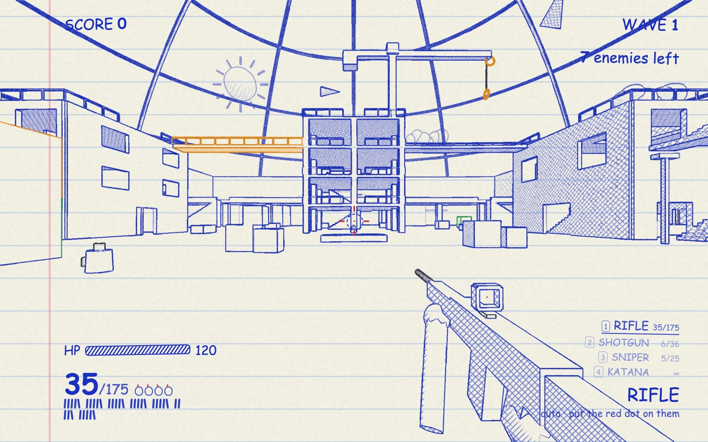
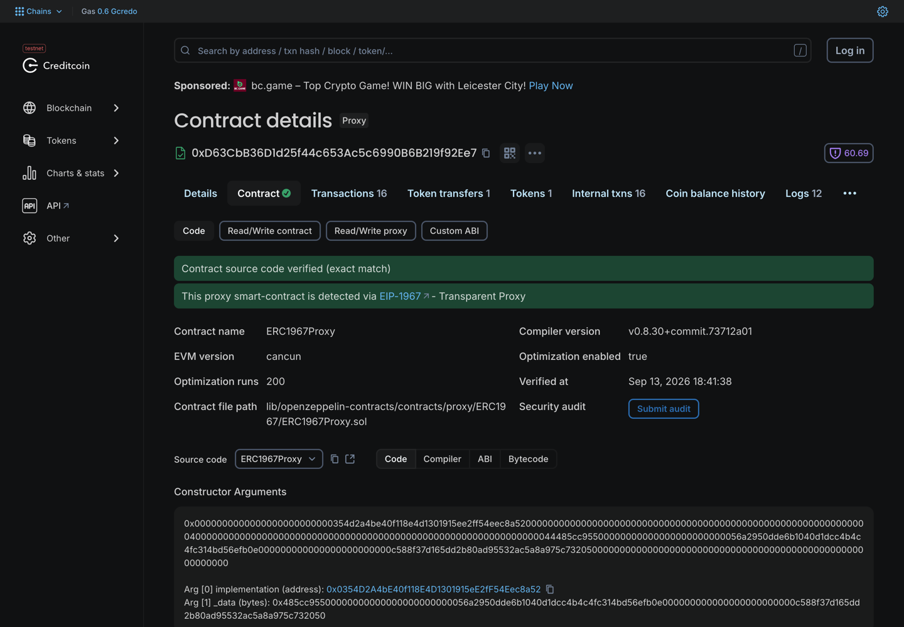
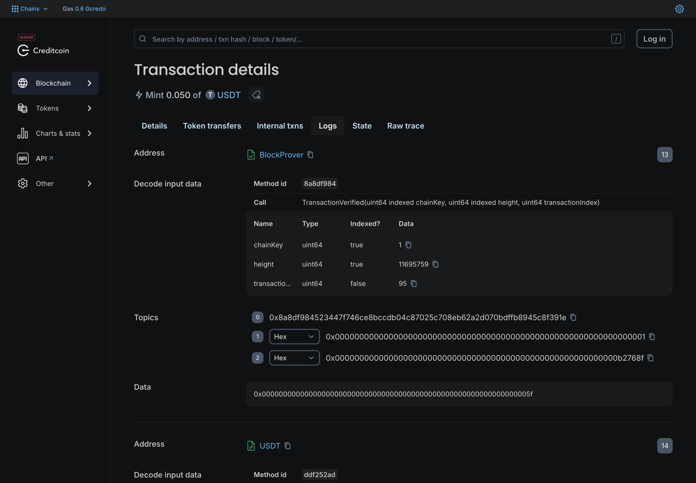
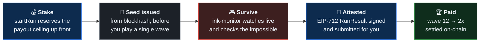
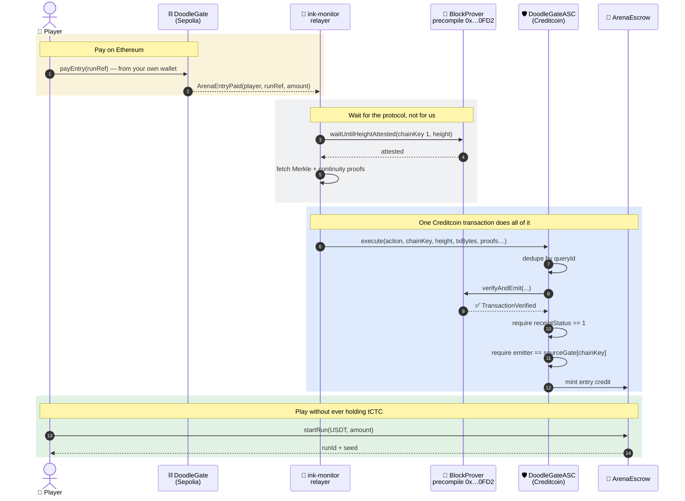
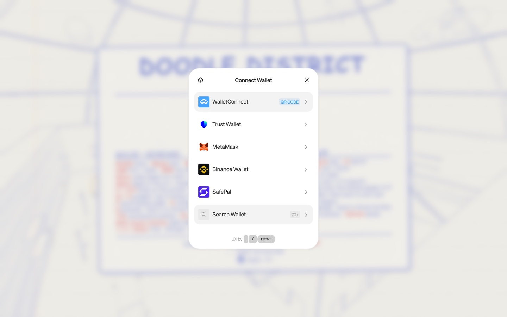
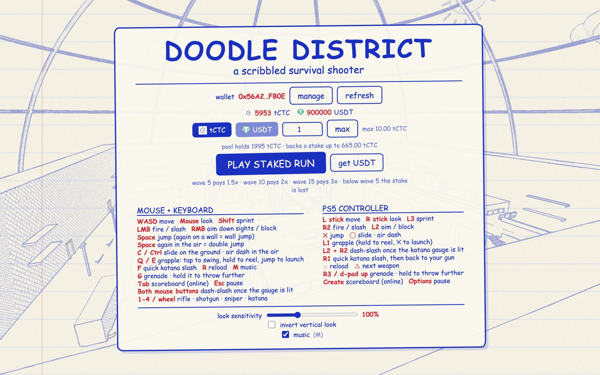
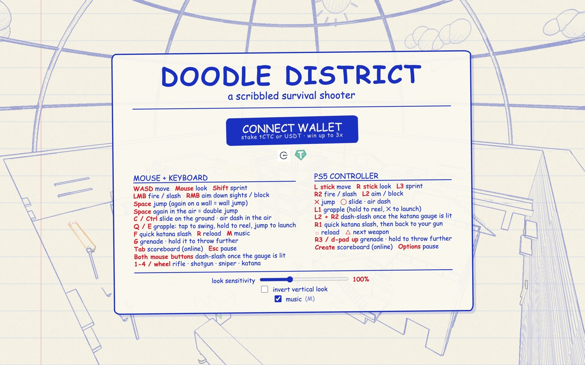

<div align="center">


# Riguwa

### A ballpoint-doodle survival shooter where the reward is real — and the chain proves you earned it before it pays.

**A staked arena on [Creditcoin](https://creditcoin.org) Testnet (102031).**
Stake tCTC or USDT, survive the waves, get paid by how far you got. Or pay your entry on
**Ethereum Sepolia** and play without ever holding tCTC — the **Attestcoin Protocol** proves your
payment on-chain, with no oracle in between.

<br/>

[](https://riguwa.xyz)
[](https://creditcoin-testnet.blockscout.com)
[](https://creditcoin-testnet.blockscout.com/address/0xD63CbB36D1d25f44c653Ac5c6990B6B219f92Ee7)
[](#-tests)
[](https://dorahacks.io/hackathon/buidl-ctc-2026-fall/detail)

**[▶ Play it — riguwa.xyz](https://riguwa.xyz)** ·
**[▶ Demo video](https://youtu.be/zuYOx_-q3ZM)** ·
**[Attestcoin Integration](../docs/ATTESTCOIN_INTEGRATION.md)** ·
**[Deployment](../contracts/DEPLOYMENT.md)** ·
**[Explorer](https://creditcoin-testnet.blockscout.com)** ·
**[Attestcoin Docs](https://docs.attestcoin.org/)**

<br/>



<sub>Wave 1 of a staked run. No models, no textures, no sound files: the paper, the ink outlines, the
hatching, the enemies and the 8-bit music are all generated in code. The seed for this run came from
<code>blockhash</code> before a single enemy spawned.</sub>

</div>

---

## The problem

Web3 games hand out tokens for things nobody can check. A leaderboard is a database row. A reward is
an airdrop from a spreadsheet. When a game does put value on-chain, it almost always trusts a server
to say who won — and asks you to trust the server too.

**The value is on-chain. The reason you earned it is not.**

And when a game reaches across chains, it usually reaches through a bridge or an oracle operator you
have to trust with the answer.

---

## What Riguwa does

The game is a finished first-person survival shooter, drawn in blue ballpoint on lined notebook
paper and rendered **entirely in code** — no models, no textures, no sound files. Every outline,
every enemy, every 8-bit music track is procedural.

On top of it sits a staking layer where **the chain settles the outcome**, and a cross-chain entry
path where **the protocol itself verifies your payment**.

| | |
|---|---|
| 🎮 **Stake to play** | Stake tCTC or USDT on a run. Reach wave 5 for 1.5x, wave 10 for 2x, wave 15 for 3x. Below wave 5 the stake joins the pool. There is no free play. |
| 🔗 **Cross-chain entry, gasless** | Pay on Sepolia; the Attestcoin block-prover precompile verifies that transaction **inside the same Creditcoin transaction** that credits you. You never hold tCTC. |
| 🎲 **The chain seeds the run** | `startRun` issues a seed from `blockhash`. The game's PRNG takes it, so the wave you faced was committed before you played. |
| 🔐 **Solvency by construction** | `startRun` reserves the payout ceiling before accepting a stake. The contract can never owe more than it holds — asserted as a fuzz invariant. |

---

## 🟢 Live on Creditcoin Testnet — verify it yourself

Every contract is **source-verified on Blockscout**. Every claim below has a link.

### Core contracts (UUPS · ERC-7201 namespaced storage)

| Contract | Address |
|---|---|
| **ArenaEscrow** — stakes, pool, settlement | [`0xD63CbB36…19f92Ee7`](https://creditcoin-testnet.blockscout.com/address/0xD63CbB36D1d25f44c653Ac5c6990B6B219f92Ee7) |
| **DoodleGateASC** — the Attestcoin Smart Contract | [`0xd6565056…248f09dF`](https://creditcoin-testnet.blockscout.com/address/0xd6565056853e4627f26B4bB4c1AEF7e9248f09dF) |
| **SeasonRegistry** — per-season leaderboard | [`0xc588f37d…5C732050`](https://creditcoin-testnet.blockscout.com/address/0xc588f37d165dd2B80AD95532aC5a8a975C732050) |
| **USDT** — mock test stablecoin, 6 dp | [`0x47dcAB80…3cbFA5B1`](https://creditcoin-testnet.blockscout.com/address/0x47dcAB80A108d6048059562AFF7d76aB3cbFA5B1) |



<sub><b>ArenaEscrow on Blockscout.</b> Verified exact-match, detected as an EIP-1967 proxy — the
upgradeable requirement, met and checkable. All four proxies needed
<code>--skip-is-verified-check</code>, because <code>ERC1967Proxy</code> runtime bytecode is
identical across deployments and forge reports three of them as already verified.</sub>

### Source chain (Ethereum Sepolia)

| Contract | Address |
|---|---|
| **DoodleGate** — emits the two events, nothing else | [`0x56CeD9fD…6da76484`](https://eth-sepolia.blockscout.com/address/0x56CeD9fD5E49C1Aba1371D7aDe383DD16da76484) |

### Receipts, not screenshots

| Claim | Proof |
|---|---|
| 🌉 **Cross-chain entry works** | [Sepolia `payEntry`](https://eth-sepolia.blockscout.com/tx/0x9ff6a14677c820b1ea73156cb7a36e1959792fdfdfbdf0f3feac42099bbb88cb) → [Creditcoin relay](https://creditcoin-testnet.blockscout.com/tx/0x021ea75fdc161883a2cefd82530a6e12e973e74b63d4e9702380805151ed21b5). 0.0005 ETH in, 0.05 USDT credited. |
| 🔏 **The precompile did the verifying** | That relay transaction's **first log is `TransactionVerified`, emitted by `0x…0FD2` itself** — the block prover, not us. |
| 🏆 **A staked run paid out** | [`settleRun`](https://creditcoin-testnet.blockscout.com/tx/0x322cf5dc365f5b460713a582831b236ca9ad884905f4254e3a477e8954361f33) — 1 tCTC staked, wave 12 reached, 2 tCTC paid. |
| ⚡ **The protocol is live right now** | `./contracts/script/check-live.sh` — chain id, supported source chains, current attestation height. |
| ✅ **The contracts pass** | `forge test` — **139 passing**, 95.19% lines, 98.04% functions. |



<sub><b>The relay transaction's first log.</b> The emitter is <b>BlockProver</b> — the precompile at
<code>0x…0FD2</code>, not our contract — carrying <code>chainKey 1</code> and the Sepolia height it
verified. That is the whole point of the integration: <b>we do not attest anything. The chain does,
and we refuse to act until it has.</b> The link above is there so you never have to trust this
image.</sub>

---

## How it works

You stake. You play. The chain decides what you earned.



And the cross-chain path, call by call — including the two checks the ASC cannot skip:



---

## 🔐 The two checks that carry the bridge

Both are called out in the Attestcoin documentation. Both have a dedicated negative test.

> ### The precompile proves **inclusion**. It does not prove **success**.
>
> A transaction that reverted on Sepolia is still *in a real block on the real chain*. Without
> `require(receipt.receiptStatus == 1)`, a reverted entry payment would mint credit anyway.
>
> Test: `test_revert_transactionThatFailedOnTheSourceChain`

> ### Event signatures are public. The emitter is the secret.
>
> ```solidity
> if (_s().sourceGate[chainKey] != emitter || emitter == address(0)) {
>     revert UnknownEmitter(chainKey, emitter);
> }
> ```
>
> Without this binding, anyone could deploy their own contract on Sepolia emitting a byte-identical
> `ArenaEntryPaid` and mint themselves unlimited credit. **This is the single most important line in
> the repository.**
>
> Test: `test_revert_eventFromAnUnregisteredEmitter`

Replay is closed by `queryId = keccak256(chainKey, blockHeight, txIndex)`, recorded in namespaced
storage. Test: `test_revert_replayOfTheSameQuery`.

---

## 🏦 Solvency is structural, not a policy

`startRun` reserves the **payout ceiling** from the pool before it accepts your stake, and refuses
the run if the pool cannot cover it:

```
require(activeRun[msg.sender] == bytes32(0));       // one run at a time
require(amount <= maxStake[token]);                 // 10 tCTC
ceiling = amount * maxMultiplierBps / 10_000;       // 3x
require(pool.free >= ceiling);                      // ← refuse rather than over-promise
```

Which makes this identity hold at every moment, and it is asserted as a **fuzz invariant across
4,096 randomised calls**:

```
balance(token) == pool.free + pool.reserved + pool.activeStake
```

**A monitor outage cannot trap a stake.** `abandonRun` is callable by anyone once the settlement
window closes, so a player is always made whole without needing our cooperation.

---

## 🤖 ink-monitor — one process, two jobs

### The run monitor

A WebSocket accepts a socket **only** for a `runId` that is `Active` on-chain and owned by the
claimed player. It then refuses anything the game's own wave formula says is impossible: a skipped
wave, an impossibly fast clear, more kills than the wave could spawn, a death claimed above the wave
reached.

> **On why it bounds rather than replays.** An earlier design replayed the game's seeded RNG stream
> to derive exact wave composition. That was abandoned deliberately: `startWave` draws from the same
> stream for the modifier, every enemy, the flavour message, seven pickup positions and a jitter per
> pickup. Any change to the game shifts the stream, and the monitor would start rejecting **honest**
> runs. It computes an upper bound instead, which needs no RNG at all — and a ceiling is exactly what
> a plausibility check needs.

When the run ends it signs an EIP-712 `RunResult` **and submits it**. The player already signed to
stake; asking them to sign again to *receive* their payout is a poor trade.

### The Attestcoin relayer

Watches `DoodleGate` on Sepolia, waits for Creditcoin's attestors to cover the block, fetches Merkle
and continuity proofs from the Proof Builder, and submits them. **The ASC verifies the proof itself**
— the relayer is a courier, not an oracle. That is what makes cross-chain entry gasless.

---

## ⏱️ Try it yourself

| | | |
|---|---|---|
| **1** | **[Open the game](https://riguwa.xyz)** | Connect a wallet. It adds and switches to Creditcoin Testnet for you. |
| **2** | **Get some USDT** | One click on the faucet — 1,000 test USDT, rate limited per address. |
| **3** | **Stake a run** | Pick tCTC or USDT, up to 10. The panel shows your balance, what the pool holds, and the stake it can actually back. |
| **4** | **Survive** | Waves, bosses every fifth. The monitor watches live and the chain already knows your seed. |
| **5** | **Get paid** | Die, and the payout lands before you leave the screen — with a Blockscout link. No second signature. |




<sub><b>Steps 1 and 3.</b> Reown AppKit on top of <code>@wagmi/core</code>, pre-bundled by hand into
<code>vendor/</code> because the game has no build step and is not getting one. The stake panel shows
both balances and, more usefully, <b>what the pool can actually back right now</b>: the cap is 10 tCTC,
but the number that matters is <code>pool.free / 3</code>, because <code>startRun</code> reserves the
full 3x payout ceiling before it takes your money.</sub>

Or skip step 2 entirely: pay on Sepolia and let the precompile prove it.

---

## 📦 What is in here

| Path | What's inside | Verify it |
|---|---|---|
| **`contracts/`** | Four UUPS contracts on Creditcoin, one plain contract on Sepolia. Escrow, ASC, season registry, mock stablecoin. | `forge test` — **139 passing**, 95.19% lines |
| **`server/`** | `ink-monitor`. Run monitor over WebSocket, Attestcoin relayer, EIP-712 signer. | `npm test` — **35 passing** |
| **`game/doodleshooter/`** | The game. Vanilla ES modules, **no build step**, three.js and Reown AppKit vendored. | `node --test` — **12 passing** |
| **`docs/`** | Design, implementation plans, and the Attestcoin integration document. | [Integration](../docs/ATTESTCOIN_INTEGRATION.md) |

---

## ⚖️ Live parameters

Read them off the chain rather than taking our word:

| Parameter | Value | Read it from |
|---|---|---|
| Max stake | **10 tCTC** / 100 USDT | `ArenaEscrow.maxStakeOf(token)` |
| Payout tiers | wave 5 → **1.5x** · 10 → **2x** · 15+ → **3x** | `ArenaEscrow.multiplierBpsFor(wave)` |
| Reward pool | **2,000 tCTC** + 100,000 USDT | `ArenaEscrow.poolOf(token)` |
| Settlement window | 2 hours, then `abandonRun` returns the stake | `ArenaEscrow.runTtl()` |
| Attestor threshold | **1** (Phase 1) | `ArenaEscrow.threshold()` |
| Source chain | Ethereum Sepolia, **chainKey 1** (not 11155111) | `DoodleGateASC.sourceGateOf(1)` |

```bash
cast call 0xD63CbB36D1d25f44c653Ac5c6990B6B219f92Ee7 "multiplierBpsFor(uint32)(uint32)" 15 \
  --rpc-url https://rpc.cc3-testnet.creditcoin.network      # 30000 = 3x
```

---

## 🛠️ Tech stack

Everything runs against **Creditcoin Testnet 102031** (`https://rpc.cc3-testnet.creditcoin.network`).

### ⛓️ `contracts/` — Solidity

| Layer | What we use |
|---|---|
| Language | **Solidity 0.8.30** |
| Toolchain | **Foundry** — `forge` · `cast`. Optimizer on, `runs = 200`, `via_ir` (several contracts hit stack-too-deep without it) |
| EVM target | **`cancun`**, not shanghai — OZ 5.7's `Math.sol` pulls in `Bytes.sol`, which emits `MCOPY`. Creditcoin was probed directly: `PUSH0`, `MCOPY` and `TSTORE`/`TLOAD` all execute; `BLOBBASEFEE` is rejected |
| Libraries | **OpenZeppelin 5.7** + Contracts-Upgradeable — UUPS, ERC-7201 namespaced storage, `EIP712`, `ECDSA`, `SafeERC20` |
| Attestcoin | **`@gluwa/asc-contracts` 0.2.1** — `EvmV1Decoder`, `INativeQueryVerifier` |
| Tests | **139 passing** — positive, edge and negative cases, fuzz, invariants, UUPS upgrade safety, and a mocked block-prover etched at `0x…0FD2` |

### ⚙️ `server/` — ink-monitor

| Layer | What we use |
|---|---|
| Runtime | **Node 24**, TypeScript run directly via `--experimental-strip-types` — no build step |
| Chain | **viem 2** — clients, contract reads and writes, EIP-712 signing, Sepolia event watching |
| Attestcoin | **`@gluwa/usc-sdk` 0.18** — `PrecompileChainInfoProvider`, `ProofBuilder`. **ethers is scoped to this one file**, because the official SDK takes an ethers provider |
| Transport | **ws 8** — the run-monitor WebSocket |
| Tests | **35 passing** with `node --test`, including a PRNG parity vector generated by the *game's own* implementation |

### 🎮 `game/doodleshooter/` — the game



<sub>The menu is plain DOM drawn in the same pen style over the canvas, and every size in it is
<code>clamp()</code>ed against viewport height so the panel scales instead of spilling off the page.</sub>

| Layer | What we use |
|---|---|
| Rendering | **three.js**, vendored. The scene renders to a buffer of shade, ink id and view-space normals plus depth; a post pass draws outlines from an inverse-depth Laplacian, then hatching, paper grain, ruled lines and the red margin |
| Audio | Procedural **WebAudio** — effects and a per-map 8-bit score, no sound files |
| Web3 | **Reown AppKit 1.8** + **@wagmi/core** + **viem 2**. `wagmi` proper needs React; the game is vanilla, so it runs on the framework-agnostic core the adapter builds on anyway |
| Build | **None.** AppKit, wagmi and viem are pre-bundled **once** by `tools/bundle-appkit.sh` into a single 1.2 MB (gzipped) ES module and committed to `vendor/`, exactly like three.js. The game installs nothing and builds nothing |
| Tests | **12 passing** — an English-only guard over every source file, and PRNG determinism |

---

## 🔒 Security & limitations

We would rather you read this than discover it.

- **Phase 1 trusts the monitor for the score.** Stated plainly rather than hidden. It does not touch
  the cross-chain claim: every piece of cross-chain data is proven by the precompile with no oracle.
  The attestor key holds **no owner rights** — it can sign a `RunResult` and nothing else — and is
  rotatable with two calls.
- **Phase 2 is a configuration change, not a rewrite.** `settleRun` verifies N-of-M attestations.
  Phase 1 registers one attestor with threshold 1; Phase 2 registers match participants with
  threshold `ceil(2n/3)`. A test proves the switch needs no contract change.
- **Online multiplayer is deliberately gated off.** The peer-to-peer code is intact but is Phase 2.
- **Attestcoin Writability is not released on testnet**, so ETH paid on Sepolia stays in
  `DoodleGate` and rewards pay in tCTC or USDT. `DoodleGate.withdraw` marks where two-way
  settlement lands when Writability ships.
- **Attestation lag is 20–40 minutes** on CC3 testnet — measured, not assumed. Cross-chain entry is
  not instant, and the relayer waits an hour before giving up.
- **The `USDT` contract is a testnet-only mock** deployed by this project. It is not issued by,
  affiliated with, or endorsed by Tether, and holds no value.

---

## 🧪 Tests

```bash
cd contracts          && forge test              # 139 passing · 95.19% lines · 98.04% functions
cd server             && npm test                # 35 passing
cd game/doodleshooter && node --test             # 12 passing
```

Plus the checks that only mean something against the real chain:

```bash
./contracts/script/check-live.sh                 # protocol liveness, opcode probe
cd server && npm run check:attestcoin            # drive the SDK against the live precompile
```

> `forge test --fork-url` does **not** work against Creditcoin: its blocks carry no `mixHash` and
> report `difficulty: 0x0`, so Foundry's fork backend rejects them with
> `header validation error: prevrandao not set`. `check-live.sh` makes the same assertions over
> plain JSON-RPC and works today.

---

<div align="center">
<br/>

**Built for [BUIDL CTC 2026 Fall](https://dorahacks.io/hackathon/buidl-ctc-2026-fall/detail)** · Gaming track

[Attestcoin Integration](../docs/ATTESTCOIN_INTEGRATION.md) · [Deployment](../contracts/DEPLOYMENT.md) ·
[Explorer](https://creditcoin-testnet.blockscout.com) · [Attestcoin Docs](https://docs.attestcoin.org/)

<sub>Testnet only. <code>USDT</code> here is a project-issued mock with no value and no affiliation with Tether.</sub>

</div>
